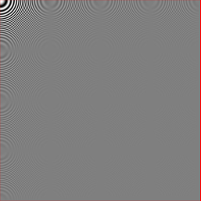
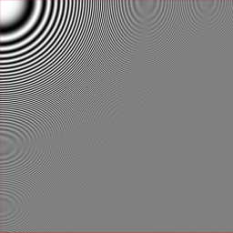
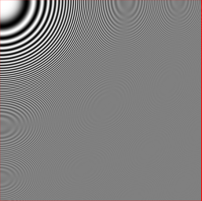
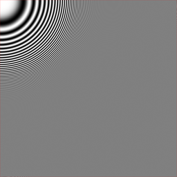
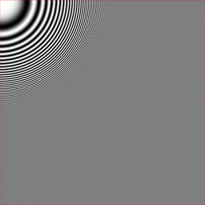
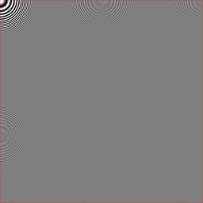
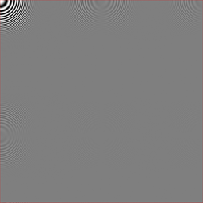
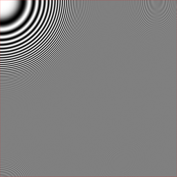

# pyvips issue #148

Test case for [libvips/pyvips#148](https://github.com/libvips/pyvips/issues/148).

## Run

```bash
# Debug
G_MESSAGES_DEBUG=all python3 test-resize.py input/radial.rgb.png

# Disable the vector path
VIPS_NOVECTOR=1 python3 test-resize.py input/radial.rgb.png
```

See [output/](output) directory.

## Output

**Notes**

- The output images were produced with the vector path disabled (due to [libvips/libvips#1518](https://github.com/libvips/libvips/issues/1518)).
- The **VIPS after** result is based upon the [`issue-512`](https://github.com/kleisauke/libvips/tree/issue-512) branch.
- The 8x versions are used for comparison.

### Pillow reduce() vs VIPS shrink()

| Pillow | VIPS before | VIPS after |
| :---: |  :---: |  :---: |
|  |  |  |
| | Last column is missing | Identical to Pillow |

### Pillow resize() vs VIPS reduce()

| Pillow | VIPS before | VIPS after |
| :---: |  :---: |  :---: |
|  |  |  |
| | Almost identical to Pillow¹ | Identical to previous image |

### Pillow resize(reducing_gap=2.0) vs VIPS resize()

| Pillow | VIPS before | VIPS after |
| :---: |  :---: |  :---: |
|  |  |  |
| | Last column is missing | Almost identical to Pillow¹ |

### Footnotes

¹ Pillow is considering pixels outside of the image as not exist, while VIPS is expanding the edge pixels outside of the image. 
  These different ways of edge handling are probably fine.

## TODO

- The vector path currently does not have the same precision as the C path (see [libvips/libvips#1518](https://github.com/libvips/libvips/issues/1518)).
- `vips_shrink()` matches the output of Pillow, should `vips_reduce()` do the same?
