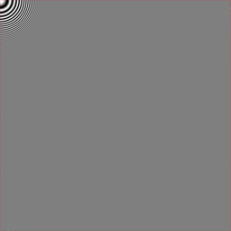
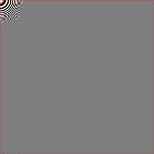
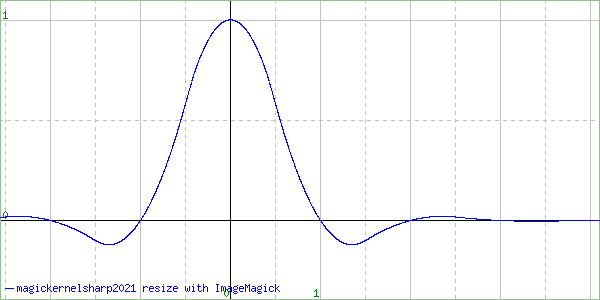

# resize-comparison

Analyzing the image scaling algorithms implemented in other libraries.

## Run

```bash
python3 test-resize.py input/radial.rgb.png

# ResampleScope
./resamplescope.sh
```

See [output/](output) directory.

## Output radial.rgb.png

**Notes**

- The 8x versions are used for comparison.

### Pillow reduce() vs libvips shrink()

| Pillow | libvips |
| :---: |  :---: |
|  |  |
| | Identical to Pillow |

### Pillow resize() vs libvips reduce()

| Pillow | libvips |
| :---: |  :---: |
|  |  |
| | Almost identical to Pillow¹ |

### Pillow resize(reducing_gap=2.0) vs libvips resize()

| Pillow | libvips |
| :---: |  :---: |
|  |  |
| | Almost identical to Pillow¹ |

### Footnotes

¹ Pillow is considering pixels outside the image as not exist, while libvips is expanding the edge pixels outside the image. 
  These different ways of edge handling are probably fine.

## Output ResampleScope

### ImageMagick box vs libvips nearest

| ImageMagick | libvips |
| :---: |  :---: |
|  |  |
| | Identical to ImageMagick |

### ImageMagick triangle vs libvips linear

| ImageMagick | libvips |
| :---: |  :---: |
|  |  |
| | Identical to ImageMagick |

### ImageMagick catrom vs libvips cubic

| ImageMagick | libvips |
| :---: |  :---: |
|  |  |
| | Identical to ImageMagick |

### ImageMagick mitchell vs libvips mitchell

| ImageMagick | libvips |
| :---: |  :---: |
|  |  |
| | Identical to ImageMagick |

### ImageMagick lanczos2 vs libvips lanczos2

| ImageMagick | libvips |
| :---: |  :---: |
|  |  |
| | Identical to ImageMagick |

### ImageMagick lanczos vs libvips lanczos3

| ImageMagick | libvips |
| :---: |  :---: |
|  |  |
| | Identical to ImageMagick |

### ImageMagick magickernelsharp2013 vs libvips mks2013

| ImageMagick | libvips |
| :---: |  :---: |
|  |  |
| Seems to be wrongly implemented | |

### ImageMagick magickernelsharp2021 vs libvips mks2021

| ImageMagick | libvips |
| :---: |  :---: |
|  |  |
| | Identical to ImageMagick |

### Magic Kernel Sharp 2013 vs Magic Kernel Sharp 2021 (reference)

| Magic Kernel Sharp 2013 | Magic Kernel Sharp 2021 |
| :---: |  :---: |
|  |  |
| | |
